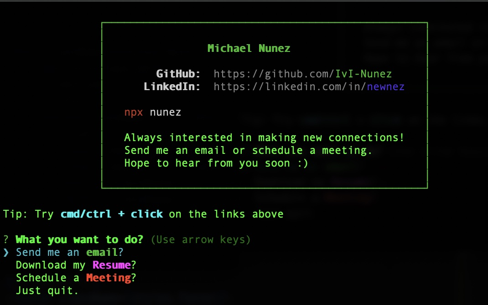

<h1 align="center">My Virtual Business Card</h1>

<h2>How to View</h2>
Simply run this in your terminal

```bash
npx nunez
```

<h3>What you'll get<h3>

<i>Note: Node.js will likely be required before running npx.</i>


<br><br>
<h2 align="center">Credit</h2>

```
Credit for the initial code structure goes to -> https://github.com/anmol098/npx_card 
```
